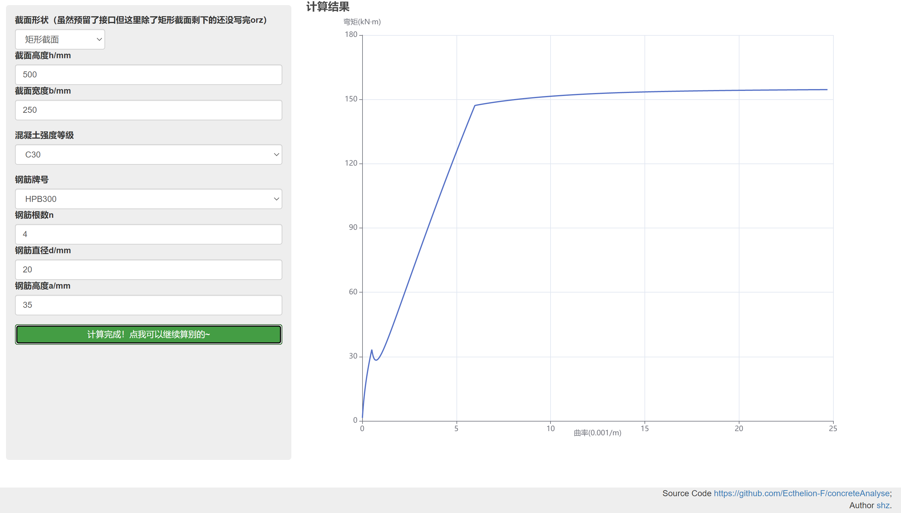
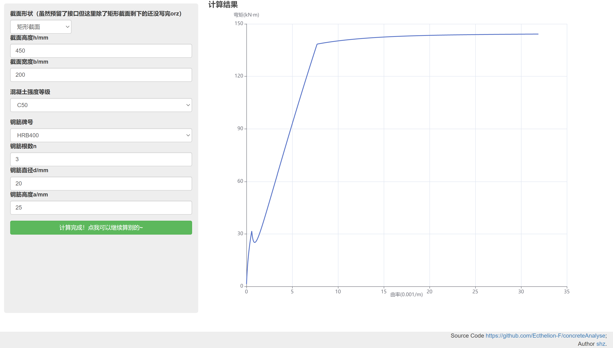

# concreteAnalyse

钢筋混凝土正截面受弯弯矩-曲率曲线分析程序

## 计算原理
+ 自小到大给定截面曲率
+ 假定受压边缘混凝土应变值$\varepsilon_c$
+ 利用平截面假定确定钢筋应变以及截面应变分布
+ 计算$C$和$y_c$、$T_c$和$y_t$、$T_s$，其中积分部分使用条带法积分，混凝土应力应变关系使用规范规定的版本
+ 验算是否满足轴力平衡条件，如果不满足，以二分的方式查找能使条件满足的$\varepsilon_c$
+ 找到合适的$\varepsilon_c$后，计算截面弯矩，进入下一级截面曲率的计算

## 技术路线
+ 成果为计算网页，为便于维护，使用前后端分离设计。
  + 后端使用 python 完成计算并利用 FastAPI 构建服务器
  + 前端使用 Bootstrap 和 jQuery 构建页面外观及逻辑，使用 Apache ECharts 实现数据可视化
+ 后端分模块设计，便于调用及二次开发

## 实现效果



## 项目主要文件功能
+ `frontEnd`文件夹：前端相关项目文件
  + `index.html`：前端项目文件
  + `echarts.js`：数据可视化依赖
+ `main.py`：服务器工程文件
+ `material.py`：材料性质模块
+ `cross_section.py`：截面状态分析模块
+ `rc_analyse.py`：受力全过程分析模块
+ `transform_dict.py`：前后端数据转换辅助模块

## 部署
### 前端
由于目前 Ajax 请求跨域问题在后端解决，前端部署相对比较简单，可以直接在浏览器中打开`./frontEnd/index.html`文件。需要注意的是由于目前部分依赖文件通过在线 CDN 引用，因此即使后端在本地启动也需要联网运行。此外，若后端不在本地运行需要修改`index.html`文件中197行的`requestUrl`变量到服务端地址。

### 后端
开发过程python版本为 3.8.7。运行前首先按照`requerements.txt`文件安装相关依赖（建议使用虚拟环境）
```shell
pip install -r requirements.txt
```
然后在项目根目录启动服务端：
```shell
python.exe -m uvicorn main:app --reload
```

## 致谢
本项目的产生离不开下列开源项目的帮助：

|         项目         |                                               首页                                               |                                 许可证                                  |
|:------------------:|:----------------------------------------------------------------------------------------------:|:--------------------------------------------------------------------:|
|      FastAPI       |                             [Home](https://fastapi.tiangolo.com/)                              |  [LICENSE](https://github.com/tiangolo/fastapi/blob/master/LICENSE)  |
|   Apache ECharts   |                              [Home](https://echarts.apache.org/)                               |   [LICENSE](https://github.com/apache/echarts/blob/master/LICENSE)   |
|       jQuery       |                                  [Home](https://jquery.com/)                                   |  [LICENSE](https://github.com/jquery/jquery/blob/main/LICENSE.txt)   |
|     Bootstrap      |                               [Home](https://getbootstrap.com/)                                |    [LICENSE](https://github.com/twbs/bootstrap/blob/main/LICENSE)    |
| react-d3-dashboard | [Home](https://medium.com/shidanqing/build-a-dashboard-application-with-react-d3-6ba4f46b876b) | Copyright (c) 2019 [sdq](https://github.com/sdq) <br>经询问作者，按照MIT协议许可 |
